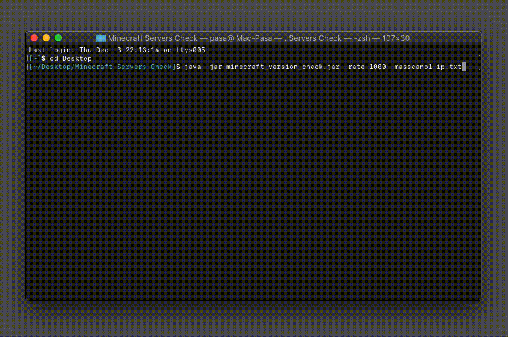
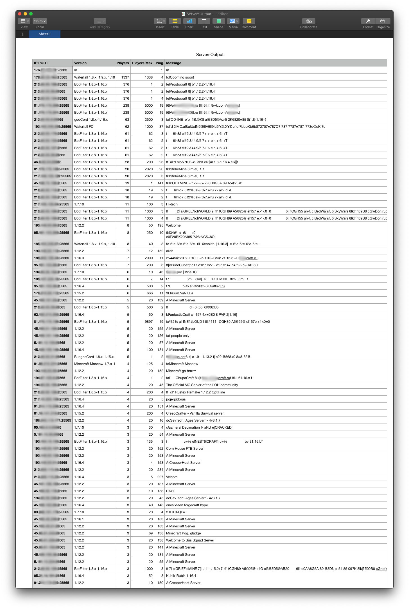

# Minecraft-scan-servers

Программа выполняет многопоточное сканирование Minecraft серверов по заданному массиву IP адресов, получает и сохраняет в .csv файл о них информацию в виде: ip:port, версии, настоящего/максимального кол-ва игроков и его описания.

Для работы необходима Java 8, или новее

## Аргументы запуска: 
-port "Число порта в диапазоне 1-65535"

-rate "Количество потоков опроса"

-masscanoL "Путь до файла с отсканированными IP адресами при помощи masscan в режиме вывода -oL"

-ipsInput "Путь до файла с IP адресами записанными построчно"

-ServersOutput "Путь сохранения файла с итоговой информацией"

Параметры вводятся без ковычек

Если указаны два параметра "-ipsInput" и "-masscanoL" одновременно, то информация будет взята из файла "-masscanoL"

Аргументы являются регистронезависимыми, к примеру: можно писать как "-masscanoL", так и "-masscanol"

## Аргументы по умолчанию, если их не указывать при запуске: 

-port=25565

-rate=200

-ipsInput=ipsinput.txt

-ServersOutput=ServersOutput.csv

## Работа программы

## Вывод файла списка серверов

